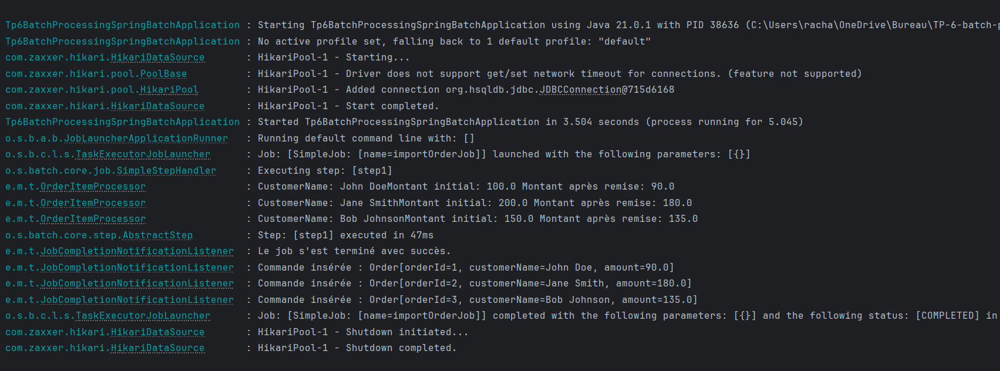

# Spring Batch Job : Traitement de Commandes

## Objectif
Ce projet vise à développer un job Spring Batch qui traite une liste de commandes provenant d'un fichier CSV, applique une remise de 10% sur le montant de chaque commande, puis écrit les commandes mises à jour dans une base de données HSQLDB.

## Fonctionnalités
1. Lire un fichier CSV contenant des commandes avec les colonnes suivantes :
   - `orderId` : Identifiant de la commande
   - `customerName` : Nom du client
   - `amount` : Montant de la commande
2. Transformer les données en appliquant une remise de 10% sur le montant.
3. Écrire les commandes transformées dans une base de données HSQLDB.
4. Afficher les commandes insérées dans la base de données après l'exécution du job.

---

## Structure du projet
Le projet contient les composants suivants :
- **Fichier CSV (`orders.csv`)** : Contient les commandes initiales.
- **FlatFileItemReader** : Permet de lire les données du fichier CSV.
- **Processor** : Applique une remise de 10% sur le montant.
- **ItemWriter** : Insère les données transformées dans une base de données HSQLDB.
- **JobCompletionNotificationListener** : Affiche les commandes insérées après la fin du job.

---

## Résultat du projet


---

## Prérequis
- Java 21
- Maven 4.0.0
- IDE compatible avec Spring Boot (IntelliJ IDEA)
- Base de données HSQLDB

---

## Installation et Exécution

1. **Cloner le projet** :
   ```bash
   git clone  https://github.com/BarbaraRacha/TP-6-batch-processing-Spring-Batch.git
